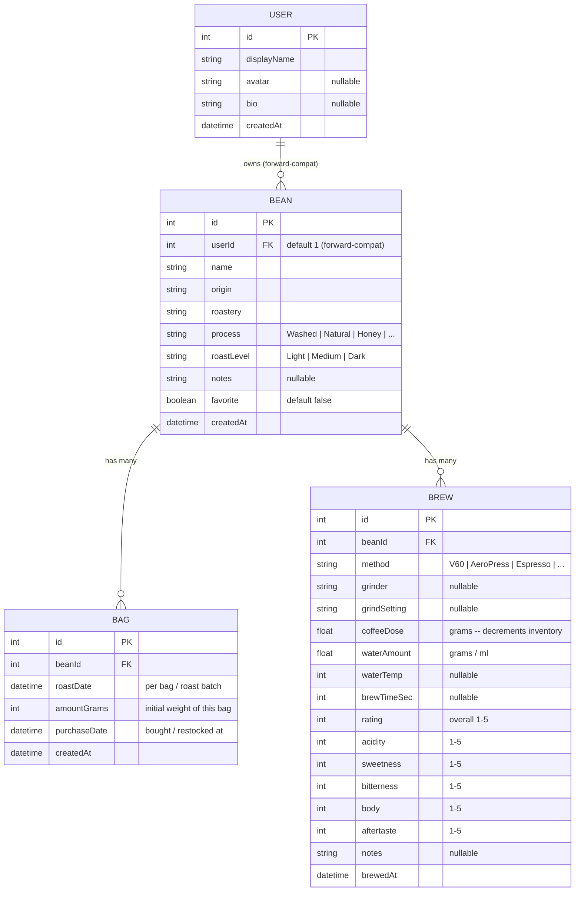

# Flavorium — Entity Relationship Diagram (MVP)

This ERD reflects the data model locked in [FEATURES.md](./FEATURES.md).

> **Note on `User`:** single-user for now — no auth is built yet. Every table carries a
> `userId` (defaults to `1`) so multi-user can be switched on later without a rewrite.
> `User` is shown here as a *forward-compatible* entity (dashed intent), not something
> the MVP implements.

---

## Relationships

| From | To | Type | Meaning |
|------|----|------|---------|
| User | Bean | 1 → many | A user owns many beans (forward-compat; single user for now) |
| Bean | Bag | 1 → many | Buying/refilling the same bean adds a new bag (each with its own roast date) |
| Bean | Brew | 1 → many | Every brewing session belongs to a bean |

## Derived / computed values (NOT stored)

These are calculated at query time, never persisted:

| Value | Formula |
|-------|---------|
| **Remaining inventory** (per bean) | `SUM(bag.amountGrams) − SUM(brew.coffeeDose)` |
| **Brew ratio** (per brew) | `brew.waterAmount ÷ brew.coffeeDose` |
| **Best recipe** (per bean) | brew with highest `rating`; tie-breaker → most recent `brewedAt` |

## Notes

* **Inventory is a ledger** — there is no mutable "remaining grams" column. Bags add stock, brews consume it, the difference is computed.
* **Consumption is aggregate** — a brew reduces the bean's *total* stock; it is not tied to a specific bag (no FIFO tracking in the MVP).
* Types shown are conceptual. Exact Prisma types (`Int`, `Float`, `DateTime`, `String`, `Boolean`) will be finalized in `schema.prisma`.
